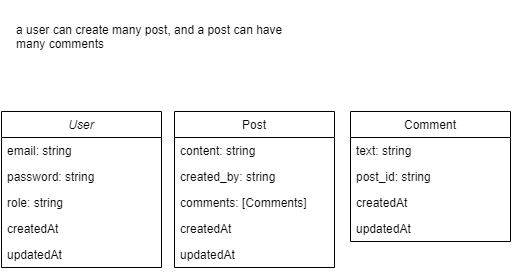

# Social App

## About

    Try to build social app basic functionality and implement everything I've learned during development this app

## Current Features (will add more eventually)

1. Register

2. Login

3. Create Post

4. Add Comment

## Stacks

### Frontend

1. React
2. Mantine UI
3. Redux Tookit
4. React Router Dom
5. Axios

### Backend

1. Express
2. Mongoose
3. Passport
4. Passport Local Mongoose

### Database

1. Mongodb

#### Initial Database Design

### Cache

1. TBD (probably Redis)
